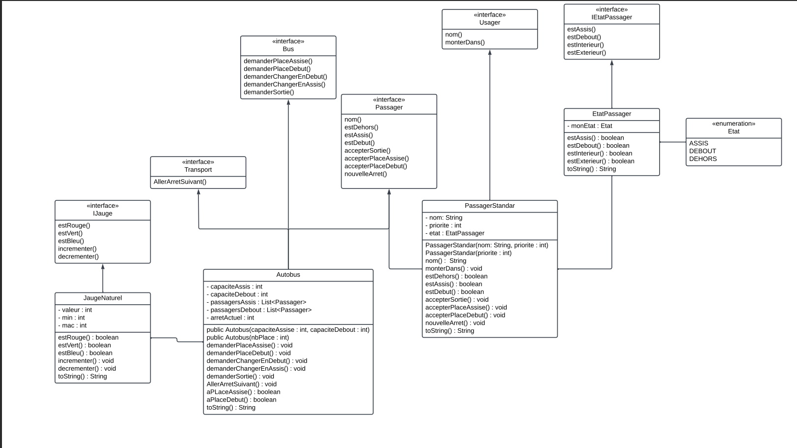

# Projet Java : Simulation d'un Système de Transport

---
## Auteurs
- **[MADAD Walid](https://github.com/walidmadad)** 

---
## Description du Projet

Ce projet simule un système de transport comprenant des autobus et des passagers. Il s’appuie sur une architecture orientée objet, permettant de modéliser différentes entités telles que les bus, les passagers et leurs interactions. L’objectif est de représenter de manière structurée les comportements des passagers (assis, debout, extérieur) et des autobus (gestion des places assises et debout) en respectant les principes de la programmation orientée objet (POO).

---
## Architecture du Projet

### Interfaces Principales

#### `Bus`

Cette interface définit les opérations qu'un bus doit implémenter. Elle inclut la gestion des places assises et debout ainsi que les interactions avec les passagers.

- **Méthodes :**
    - `demanderPlaceAssise(Passager p)` : Permet à un passager de demander une place assise.
    - `demanderPlaceDebout(Passager p)` : Permet à un passager de demander une place debout.
    - `demanderChangerEnDebout(Passager p)` : Permet à un passager de demander à changer pour une place debout.
    - `demanderChangerEnAssis(Passager p)` : Permet à un passager de demander à changer pour une place assise.
    - `demanderSortie(Passager p)` : Permet à un passager de demander à sortir du bus.

---

#### `Transport`

Cette interface marque les entités qui peuvent se déplacer vers l'arrêt suivant.

- **Méthode :**
    - `allerArretSuivant()` : Déplace le transport vers l'arrêt suivant.

---

#### `Passager`

Représente un passager et ses interactions avec le transport. Cette interface permet de gérer l'état et les actions d'un passager dans un transport.

- **Méthodes :**
    - `nom()` : Fournit le nom du passager.
    - `estDehors()` : Vérifie si le passager est dehors.
    - `estAssis()` : Vérifie si le passager est assis.
    - `estDebout()` : Vérifie si le passager est debout.
    - `accepterSortie()` : Permet au passager de sortir du transport.
    - `accepterPlaceAssise()` : Permet au passager d'accepter une place assise.
    - `accepterPlaceDebout()` : Permet au passager d'accepter une place debout.
    - `nouvelArret()` : Notifie le passager d'un nouvel arrêt.

---

#### `Usager`

Définit le type manipulé par le programme principal, déterminant le comportement d'un passager à la montée (place assise, debout ou dehors). Le transport est responsable d'autoriser ou de refuser la demande.

- **Méthodes :**
    - `String nom()` : Fournit le nom de l'usager.
    - `void monterDans(Transport t) throws UsagerInvalideException` : Permet à l'usager de monter dans un transport, en tenant compte de son état et de la disponibilité du transport. Peut lever l'exception `UsagerInvalideException` si la demande est incohérente.

---

#### `IJauge`

Interface représentant une jauge dont l'état peut être vérifié et modifié. Elle est utilisée pour suivre des informations comme le nombre de places disponibles ou d'autres ressources.

- **Méthodes :**
    - `boolean estRouge()` : Vérifie si la jauge est en rouge.
    - `boolean estVert()` : Vérifie si la jauge est en vert.
    - `boolean estBleu()` : Vérifie si la jauge est en bleu.
    - `void incrementer()` : Incrémente la valeur de la jauge.
    - `void decrementer()` : Décrémente la valeur de la jauge.

---

#### `IEtatPassager`

Définit les états possibles d'un passager dans un transport. Permet de vérifier l'état actuel du passager.

- **Méthodes :**
    - `boolean estAssis()` : Vérifie si le passager est assis.
    - `boolean estDebout()` : Vérifie si le passager est debout.
    - `boolean estInterieur()` : Vérifie si le passager est à l'intérieur du transport.
    - `boolean estExterieur()` : Vérifie si le passager est à l'extérieur du transport.

---

### Classes Principales

#### `Autobus`

Représente un autobus capable de gérer des places assises et debout. Implémente les opérations définies par l'interface `Bus`.

- **Attributs :**
    - `capaciteAssis` : Nombre maximum de places assises.
    - `capaciteDebout` : Nombre maximum de places debout.
    - `passagersAssis` : Liste des passagers assis.
    - `passagersDebout` : Liste des passagers debout.
    - `arretActuel` : Arrêt actuel du bus.
- **Méthodes :**
    - `demanderPlaceAssise(Passager p)` : Demande une place assise pour un passager.
    - `demanderPlaceDebout(Passager p)` : Demande une place debout pour un passager.
    - `allerArretSuivant()` : Déplace le bus vers l'arrêt suivant.
    - `aPlaceAssise()` : Vérifie si une place assise est disponible.
    - `aPlaceDebout()` : Vérifie si une place debout est disponible.

---

#### `PassagerStandard`

Implémente l'interface `Passager`. Représente un passager standard avec un nom et un état.

- **Attributs :**
    - `nom` (String) : Nom du passager.
    - `priorite` (int) : Priorité du passager.
    - `etat` (EtatPassager) : État du passager (ASSIS, DEBOUT, DEHORS).
- **Méthodes :**
    - `accepterSortie()` : Permet au passager de sortir.
    - `accepterPlaceAssise()` : Permet au passager de prendre une place assise.
    - `accepterPlaceDebout()` : Permet au passager de prendre une place debout.
    - `nouvelArret()` : Notifie le passager d'un nouvel arrêt.

---

#### `EtatPassager`

Gère l'état d'un passager, qui peut être assis, debout ou dehors.

- **Attributs :**
    - `monEtat` (Etat) : État actuel du passager.
- **Méthodes :**
    - `estAssis()` : Vérifie si le passager est assis.
    - `estDebout()` : Vérifie si le passager est debout.
    - `estExterieur()` : Vérifie si le passager est à l'extérieur.

---

#### `JaugeNaturel`

Gère une jauge numérique permettant de suivre une valeur dans un intervalle. Peut être utilisée pour des jauges de places disponibles, de capacité, etc.

- **Attributs :**
    - `valeur` : Valeur actuelle de la jauge.
    - `min` : Valeur minimale de la jauge.
    - `max` : Valeur maximale de la jauge.
- **Méthodes :**
    - `estRouge()` : Vérifie si la jauge est en état rouge.
    - `estVert()` : Vérifie si la jauge est en état vert.
    - `incrementer()` : Incrémente la valeur de la jauge.
    - `decrementer()` : Décrémente la valeur de la jauge.

---

#### `Etat`

Cette classe définit les états possibles d'un passager.

- **Valeurs :**
    - `ASSIS` : Le passager est assis.
    - `DEBOUT` : Le passager est debout.
    - `DEHORS` : Le passager est dehors.

---

## Gestion des Exceptions

### `UsagerInvalideException`

L'exception `UsagerInvalideException` est levée lorsqu'un usager ne peut pas être pris en charge par un transport en raison de la disponibilité des places ou d'un état incohérent.

- **Constructeurs :**
    - `UsagerInvalideException(String message)` : Crée une exception avec un message d'erreur.
    - `UsagerInvalideException(String message, Usager u, Transport t)` : Crée une exception avec un message, un usager et un transport spécifiés.

- **Attributs :**
    - `quelUsager` : L'usager associé à l'exception.
    - `quelTransport` : Le transport associé à l'exception.
---
## [Diagramme de classe](diagrammeUML/diagrammeDeClasse.png)


---
## Instructions pour l'Exécution

1. **Prérequis** :
    - JDK 8 ou plus.
    - Un IDE comme IntelliJ IDEA ou Eclipse.

2. **Instalation** 

    ```bash
    git clone https://github.com/walidmadad/walidmadad-Simulation--Systeme-de-Transport.git
    ```
   
3. **Lancer Simple.java**

---

## Fonctionnalités
- Gestion des passagers dans un autobus.

- Simulation des arrêts successifs.

- Prise en charge des états des passagers (ASSIS, DEBOUT, DEHORS).

- Gestion des jauges pour les places disponibles.

- Gestion dynamique de la montée et descente des passagers à chaque arrêt.

- Notifications en temps réel des changements d'état des passagers.

- Possibilité de configurer la capacité maximale des autobus.

- Simulation de scénarios réalistes avec plusieurs arrêts et plusieurs bus.

- Extension facile pour ajouter d'autres types de transports (ex. : trains, métros).

---
## Conclusion 

Ce projet représente une simulation riche et modulable d’un système de transport, offrant une base solide pour des améliorations et des extensions futures. Il illustre l'application des principes de la programmation orientée objet dans un contexte concret et éducatif.

Que vous soyez étudiant, développeur ou passionné par les systèmes de transport, ce projet est une excellente opportunité pour apprendre, expérimenter, et contribuer.

Bon développement et merci de faire partie de ce voyage ! 🚍
